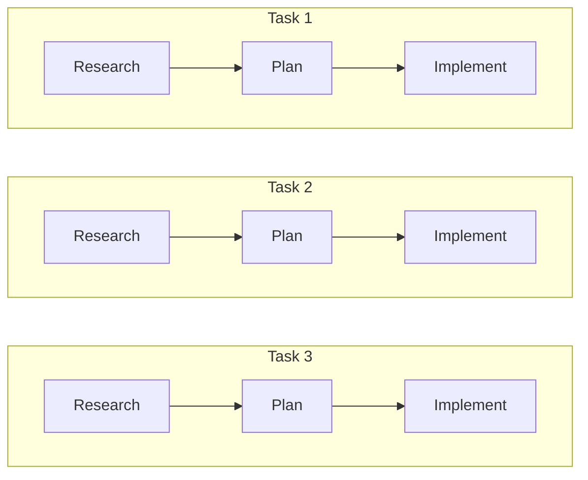
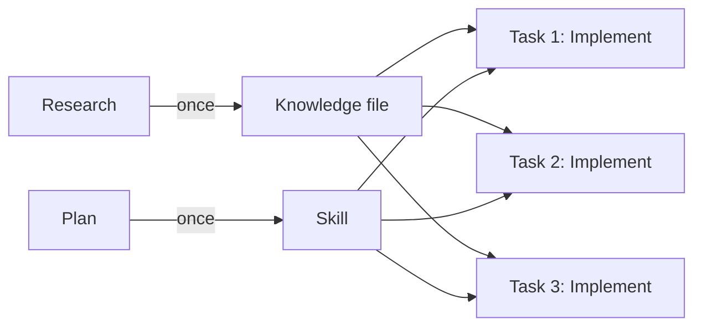
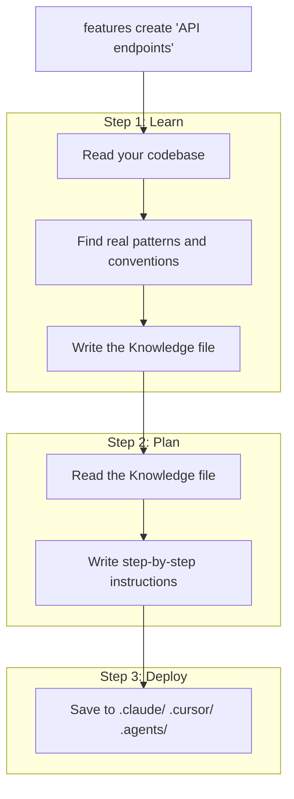

<div align="center">

<picture>
  <source media="(prefers-color-scheme: dark)" srcset="assets/logo-dark.svg">
  <source media="(prefers-color-scheme: light)" srcset="assets/logo-light.svg">
  
</picture>

**Teach your Code Agent about your codebase once. Stop paying for it to re-learn on every task.**

Your repo has features -- API endpoints, auth, database models, UI components. Instead of letting your agent scan everything every time, give it a small, precise context for each area: what it needs to know and exactly how to make changes. Less noise, better code.

[](https://github.com/anthropics/claude-code)
[](https://cursor.sh)
[![Codex](https://img.shields.io/badge/Codex-6C3CE1?style=flat-square&logo=data%3Aimage%2Fsvg%2Bxml%3Bbase64%2CPHN2ZyB4bWxucz0iaHR0cDovL3d3dy53My5vcmcvMjAwMC9zdmciIHZpZXdCb3g9IjAgMCAyNCAyNCIgZmlsbD0id2hpdGUiPjxwYXRoIGQ9Ik0yMi4yODIgOS44MjFhNS45ODUgNS45ODUgMCAwIDAtLjUxNi00LjkxIDYuMDQ2IDYuMDQ2IDAgMCAwLTYuNTEtMi45QTYuMDY1IDYuMDY1IDAgMCAwIDQuOTgxIDQuMThhNS45OTggNS45OTggMCAwIDAtMy45OTIgMi45IDYuMDUgNi4wNSAwIDAgMCAuNzQzIDcuMDk3IDUuOTggNS45OCAwIDAgMCAuNTEgNC45MTEgNi4wNTEgNi4wNTEgMCAwIDAgNi41MTUgMi45QTUuOTg1IDUuOTg1IDAgMCAwIDEzLjI2IDI0YTYuMDU2IDYuMDU2IDAgMCAwIDUuNzcyLTQuMjA2IDUuOTkgNS45OSAwIDAgMCAzLjk5Ny0yLjkgNi4wNTYgNi4wNTYgMCAwIDAtLjc0Ny03LjA3M3pNMTMuMjYgMjIuNDNhNC40NzYgNC40NzYgMCAwIDEtMi44NzYtMS4wNGwuMTQxLS4wODEgNC43NzktMi43NThhLjc5NS43OTUgMCAwIDAgLjM5Mi0uNjgxdi02LjczN2wyLjAyIDEuMTY4YS4wNzEuMDcxIDAgMCAxIC4wMzguMDUydjUuNTgzYTQuNTA0IDQuNTA0IDAgMCAxLTQuNDk0IDQuNDk0ek0zLjYgMTguMzA0YTQuNDcgNC40NyAwIDAgMS0uNTM1LTMuMDE0bC4xNDIuMDg1IDQuNzgzIDIuNzU5YS43NzEuNzcxIDAgMCAwIC43OCAwbDUuODQzLTMuMzY5djIuMzMyYS4wOC4wOCAwIDAgMS0uMDMzLjA2Mkw5Ljc0IDE5Ljk1YTQuNSA0LjUgMCAwIDEtNi4xNC0xLjY0NnpNMi4zNCA3Ljg5NmE0LjQ4NSA0LjQ4NSAwIDAgMSAyLjM2Ni0xLjk3M1YxMS42YS43NjYuNzY2IDAgMCAwIC4zODguNjc2bDUuODE1IDMuMzU1LTIuMDIgMS4xNjhhLjA3Ni4wNzYgMCAwIDEtLjA3MSAwbC00LjgzLTIuNzg2QTQuNTA0IDQuNTA0IDAgMCAxIDIuMzQgNy44NzJ6bTE2LjU5NyAzLjg1NWwtNS44MzMtMy4zODdMMTUuMTE5IDcuMmEuMDc2LjA3NiAwIDAgMSAuMDcxIDBsNC44MyAyLjc5MWE0LjQ5NCA0LjQ5NCAwIDAgMS0uNjc2IDguMTA1di01LjY3OGEuNzkuNzkgMCAwIDAtLjQwNy0uNjY3em0yLjAxLTMuMDIzbC0uMTQxLS4wODUtNC43NzQtMi43ODJhLjc3Ni43NzYgMCAwIDAtLjc4NSAwTDkuNDA5IDkuMjNWNi44OTdhLjA2Ni4wNjYgMCAwIDEgLjAyOC0uMDYxbDQuODMtMi43ODdhNC41IDQuNSAwIDAgMSA2LjY4IDQuNjZ6bS0xMi42NCA0LjEzNWwtMi4wMi0xLjE2NGEuMDguMDggMCAwIDEtLjAzOC0uMDU3VjYuMDc1YTQuNSA0LjUgMCAwIDEgNy4zNzUtMy40NTNsLS4xNDIuMDhMOC43MDQgNS40NmEuNzk1Ljc5NSAwIDAgMC0uMzkzLjY4MXptMS4wOTctMi4zNjVsMi42MDItMS41IDIuNjA3IDEuNXYyLjk5OWwtMi41OTcgMS41LTIuNjA3LTEuNXoiLz48L3N2Zz4%3D)](https://openai.com/codex)
[](https://nodejs.org)
[](LICENSE)

</div>

<br/>

---

## TL;DR

<br/>

Features gives your coding agent reusable context for each area of your repo.

Instead of scanning the same files on every task, the agent gets the exact knowledge and instructions it needs for the feature it is changing. You pay for codebase research once, then reuse it across future work.

**Less context waste. Faster tasks. More consistent code.**

<br/>

---

<br/>

## The Problem

Code agents are useful, but they are expensive when every task starts with discovery.

You ask for an API endpoint on Monday. On Friday, you ask for another one. The agent re-reads the same files, re-discovers the same conventions, and may choose a slightly different path. You pay again for context it already learned before.



> *Three tasks, three full research cycles. Same codebase, same wasted tokens, different results each time.*

<br/>

## The Solution

Your codebase already has natural areas: API endpoints, auth, database models, UI components. Each area has its own files, patterns, and rules.

**Features** turns each area into reusable agent context:

1. **Knowledge file** -- the facts the agent needs: file locations, naming conventions, patterns, dependencies, and gotchas.

2. **Skill** -- the steps the agent should follow when changing that area.

Instead of dumping the whole repo into context, you give the agent a small, accurate slice for the work in front of it. Nothing more.



> **Feature = Knowledge file + Skill. Better results, fewer tokens.**

<br/>

## Why It Works

<table>
<tr>
<td width="33%" align="center">

### Small Context, Precise Results

Instead of reading your whole codebase, the agent gets **only what's relevant** to the area it's working on -- verified by you. Small, focused context means fewer hallucinations, no missed conventions, and the same accurate results every time.

</td>
<td width="33%" align="center">

### Massive Token Savings

Without Features, every task pays for scanning your entire codebase + planning + execution. With Features, the agent reads a small Knowledge file and a Skill, then **implements the change**. No scanning, no planning. You replace thousands of tokens of research with a few hundred tokens of focused context.

</td>
<td width="33%" align="center">

### Your Knowledge Stays Up to Date

Each Skill tells the agent to **update the Knowledge file and its own instructions** whenever the code changes. Your Features grow with your codebase automatically.

</td>
</tr>
</table>

<br/>

> [!TIP]
> Create Features for every area of your repo. You do the research and planning **once for the entire codebase** -- after that, every task is implementation only.

<br/>

## Features vs Ponytail vs Caveman

All three save tokens, but they cut different waste:

| Tool | Saves | How | Quality guardrail |
|------|-------|-----|-------------------|
| **Features** | Repeated repo research and planning | Stores verified codebase knowledge + task steps per feature, then injects only the relevant slice | Keeps feature knowledge updated after changes; implementation still follows the repo's real patterns |
| **Ponytail** | Overbuilt code | Forces the agent up the lazy ladder: stdlib, native platform, installed dependency, one line, then minimum code | Never cuts validation, data-loss handling, security, or accessibility |
| **Caveman** | Verbose replies | Compresses what the agent says, not what it knows | Keeps technical accuracy, commands, paths, code, and errors intact |

Use them together: **Features chooses the right context, Ponytail keeps the diff small, Caveman keeps the explanation short.** That means better savings without compromising code quality.

<br/>

## Plan

Inspired by strong 30k+ star agent READMEs like Claude Code, Codex, and Aider, plus focused token-saving projects like Ponytail and Caveman:

1. **Show the before/after** -- same task with and without Features: files read, tokens spent, time, and diff quality.
2. **Publish reproducible benchmarks** -- baseline agent vs Features on real repo tasks; measure research tokens, implementation tokens, latency, files touched, and tests passed.
3. **Separate savings from quality** -- savings only count when tests pass and the diff follows existing project conventions.
4. **Make compatibility obvious** -- document Claude Code, Codex, Cursor, and `.agents/` support with exact install/use commands.
5. **Keep the pitch concrete** -- one promise, one diagram, one command, one benchmark table. No vague AI productivity claims.

<br/>

---

<br/>

## Quick Start

### Prerequisites

- **Node.js** >= 20
- **Claude Code CLI** -- `npm install -g @anthropic-ai/claude-code`

### 1. Install

```bash
curl -fsSL https://raw.githubusercontent.com/michael-elkabetz/features/main/install.sh | bash
```

Or install directly via npm:

```bash
npm install -g github:michael-elkabetz/features
```

<details>
<summary>Manual installation</summary>

```bash
git clone https://github.com/michael-elkabetz/features.git
cd features
npm install
npm run build
npm link
```

</details>

### 2. Create Your First Feature

Pick an area of your codebase and run:

```bash
features create "API endpoints"
```

That's it. Features will read your code, write a Knowledge file about how API endpoints work in your project, create a Skill with step-by-step instructions for adding or changing endpoints, and deploy both to your agent directories.

### Uninstall

```bash
curl -fsSL https://raw.githubusercontent.com/michael-elkabetz/features/main/install.sh | bash -s -- --uninstall
```

<br/>

## How It Works

You run one command. Features does the rest in three steps:



Under the hood, each step uses Claude Code with carefully written prompts to make sure the research is deep and accurate.

### Knowledge file creation

The Knowledge file isn't a dump of your whole codebase. It's the output of a four-step pipeline on a single area of your repo:

1. **Scan** -- map the landscape: directory structure, language, frameworks, entry points. Find where the code for this area lives.
2. **Extract** -- read the actual files, trace data flow, identify naming conventions, pull out recurring patterns and implicit rules the team follows but never wrote down.
3. **Distill** -- turn raw observations into structured knowledge. Validate every finding against the real code. Keep only what is specific, current, and actionable.
4. **Forge** -- write the Knowledge file using a category-matched template (architecture, conventions, component patterns, domain knowledge, or lessons learned).

The full prompt that drives this pipeline lives at [`prompts/KB-CREATION.md`](prompts/KB-CREATION.md).

<p align="center">
  
</p>

### Skill creation

For the Skill, we don't reinvent anything. We use Anthropic's [skill-creator](https://github.com/anthropics/skills/tree/main/skills/skill-creator) and always pull the latest version directly from their GitHub, so every Skill we generate follows their current best practices.

We then hand skill-creator the Knowledge file we just built and ask it to generate a Skill that specializes in working on this one specific Feature. The result is a focused, step-by-step Skill tailored to that area of your codebase -- not a generic template. The orchestration prompt lives at [`prompts/SKILL-CREATION.md`](prompts/SKILL-CREATION.md).

<p align="center">
  
</p>

### Execution

Once the Knowledge and Skill are created, we inject them into the agent's context and add a few hard rules on top:

> - You ALREADY have all the knowledge you need below. Do NOT explore, scan, or investigate the codebase to understand it.
> - Do NOT use Glob, Grep, or subagents to discover patterns or architecture - that work has already been done for you.
> - ONLY read specific files when you need to edit them.

Without a Feature, every task starts with the agent scanning directories, grepping for patterns, reading dozens of files, and running tools just to understand the codebase -- all of that burns tokens before a single line of code is written. With a Feature, all that exploration and planning is eliminated. The agent already has the verified context and the exact steps to follow, so it goes straight to implementation.

<p align="center">
  
</p>

<br/>

## Usage

```bash
# Analyze the repo and generate browsable feature knowledge
features init

# Browse the generated knowledge in a local web viewer
features serve

# Create a reusable Feature (Knowledge + Skill) for one area of your codebase
features create "API endpoints"

# Implement a task with Claude Code; Features tells Claude to use feature knowledge when relevant
features implement "Add rate limiting to API endpoints"

# Scan for newly discovered features and add only the new ones
features sync
```

`features init` builds `.features/`. `features serve` opens the viewer. `features create` creates reusable agent knowledge. `features implement` runs Claude with feature context. `features sync` adds newly discovered features.

<br/>

## Output

After running `features create`, you get one reusable Feature in your repo:

```
your-repo/
  .features/
    features-api-endpoints/
      kb/
        KNOWLEDGE.md          ← Everything the agent needs to know
      skill/
        SKILL.md              ← Step-by-step instructions for changes
```

The Skill is also copied to your agent directories so Claude Code, Cursor, and other tools pick it up automatically:

```
.claude/skills/features-api-endpoints/
.cursor/skills/features-api-endpoints/
.agents/skills/features-api-endpoints/
```

After running `features init` or `features sync`, you get browsable repo knowledge:

```
your-repo/
  .features/
    overview.md
    manifest.json
    features/
      _inventory.json
      cli.md
      api.md
    skills/
      cli.md
      api.md
```

<br/>

## Project Structure

```
features/
├── src/
│   ├── index.ts              # Entry point - Commander CLI
│   ├── commands/             # implement, create, init, sync, serve
│   ├── services/             # Feature creation, analysis, compile, serve services
│   ├── clients/              # Claude, Git, and editor clients
│   ├── repositories/         # Filesystem-backed persistence
│   ├── codemap/              # Repo map generation for analysis context
│   ├── context/              # Prompt context and generated skill rendering
│   ├── spec/                 # Feature document schemas and validation
│   └── ui/                   # Clack-based terminal prompts
├── prompts/
│   ├── KB-CREATION.md        # Manual Feature KB creation prompt
│   ├── SKILL-CREATION.md     # Manual Feature Skill creation prompt
│   ├── INVENTORY.md          # Repo inventory prompt
│   ├── FEATURE-COMBINED.md   # Repo feature analysis prompt
│   ├── FEATURE-DEEPDIVE.md   # Live-mode feature refresh prompt
│   └── FEATURE-SKILL.md      # Legacy/generated skill prompt
├── viewer-dist/              # Built web viewer
└── dist/                     # Built CLI output
```

<br/>

---

<div align="center">

<br/>

MIT License

Built with ❤️ by <a href="https://mike.org.il">Mike</a>

</div>
