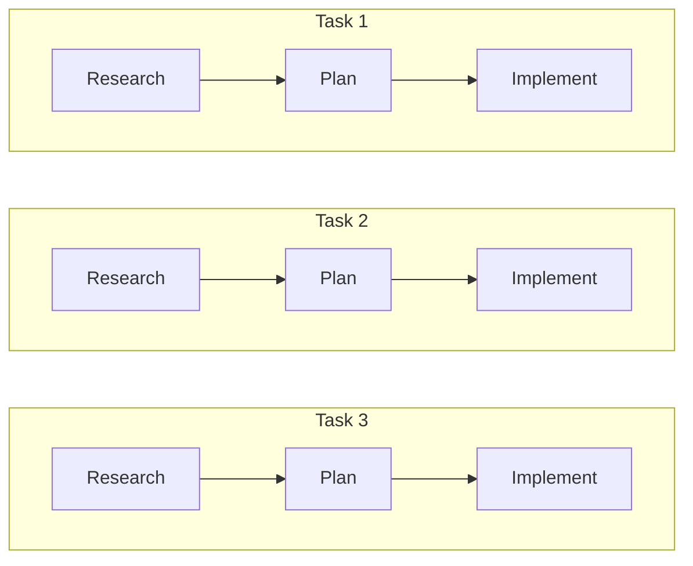
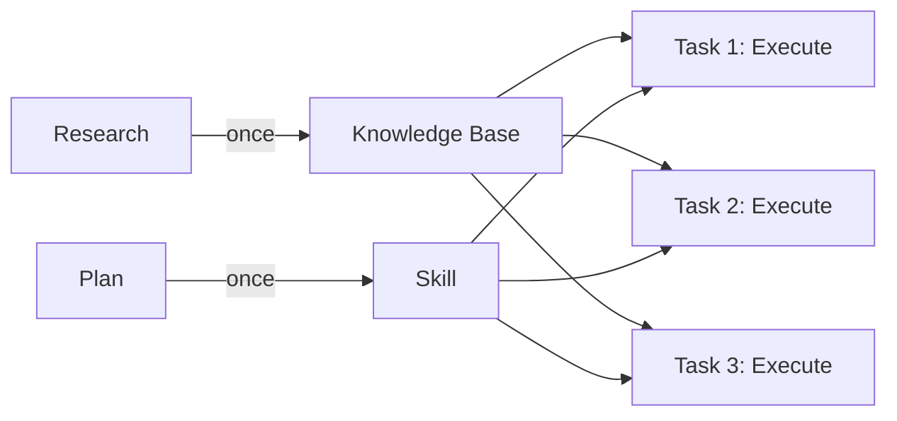
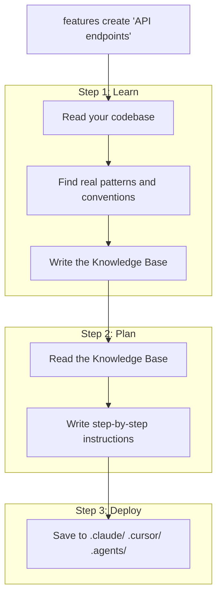

<div align="center">

<picture>
  <source media="(prefers-color-scheme: dark)" srcset="assets/logo-dark.svg">
  <source media="(prefers-color-scheme: light)" srcset="assets/logo-light.svg">
  
</picture>

**Teach your AI agent about your codebase once. Stop paying for it to re-learn on every task.**

Your repo has features -- API endpoints, auth, database models, UI components. Instead of letting your agent scan everything every time, give it a small, precise context for each area: what it needs to know and exactly how to make changes. Less noise, better code.

[](https://github.com/anthropics/claude-code)
[](https://cursor.sh)
[![Codex](https://img.shields.io/badge/Codex-6C3CE1?style=flat-square&logo=data%3Aimage%2Fsvg%2Bxml%3Bbase64%2CPHN2ZyB4bWxucz0iaHR0cDovL3d3dy53My5vcmcvMjAwMC9zdmciIHZpZXdCb3g9IjAgMCAyNCAyNCIgZmlsbD0id2hpdGUiPjxwYXRoIGQ9Ik0yMi4yODIgOS44MjFhNS45ODUgNS45ODUgMCAwIDAtLjUxNi00LjkxIDYuMDQ2IDYuMDQ2IDAgMCAwLTYuNTEtMi45QTYuMDY1IDYuMDY1IDAgMCAwIDQuOTgxIDQuMThhNS45OTggNS45OTggMCAwIDAtMy45OTIgMi45IDYuMDUgNi4wNSAwIDAgMCAuNzQzIDcuMDk3IDUuOTggNS45OCAwIDAgMCAuNTEgNC45MTEgNi4wNTEgNi4wNTEgMCAwIDAgNi41MTUgMi45QTUuOTg1IDUuOTg1IDAgMCAwIDEzLjI2IDI0YTYuMDU2IDYuMDU2IDAgMCAwIDUuNzcyLTQuMjA2IDUuOTkgNS45OSAwIDAgMCAzLjk5Ny0yLjkgNi4wNTYgNi4wNTYgMCAwIDAtLjc0Ny03LjA3M3pNMTMuMjYgMjIuNDNhNC40NzYgNC40NzYgMCAwIDEtMi44NzYtMS4wNGwuMTQxLS4wODEgNC43NzktMi43NThhLjc5NS43OTUgMCAwIDAgLjM5Mi0uNjgxdi02LjczN2wyLjAyIDEuMTY4YS4wNzEuMDcxIDAgMCAxIC4wMzguMDUydjUuNTgzYTQuNTA0IDQuNTA0IDAgMCAxLTQuNDk0IDQuNDk0ek0zLjYgMTguMzA0YTQuNDcgNC40NyAwIDAgMS0uNTM1LTMuMDE0bC4xNDIuMDg1IDQuNzgzIDIuNzU5YS43NzEuNzcxIDAgMCAwIC43OCAwbDUuODQzLTMuMzY5djIuMzMyYS4wOC4wOCAwIDAgMS0uMDMzLjA2Mkw5Ljc0IDE5Ljk1YTQuNSA0LjUgMCAwIDEtNi4xNC0xLjY0NnpNMi4zNCA3Ljg5NmE0LjQ4NSA0LjQ4NSAwIDAgMSAyLjM2Ni0xLjk3M1YxMS42YS43NjYuNzY2IDAgMCAwIC4zODguNjc2bDUuODE1IDMuMzU1LTIuMDIgMS4xNjhhLjA3Ni4wNzYgMCAwIDEtLjA3MSAwbC00LjgzLTIuNzg2QTQuNTA0IDQuNTA0IDAgMCAxIDIuMzQgNy44NzJ6bTE2LjU5NyAzLjg1NWwtNS44MzMtMy4zODdMMTUuMTE5IDcuMmEuMDc2LjA3NiAwIDAgMSAuMDcxIDBsNC44MyAyLjc5MWE0LjQ5NCA0LjQ5NCAwIDAgMS0uNjc2IDguMTA1di01LjY3OGEuNzkuNzkgMCAwIDAtLjQwNy0uNjY3em0yLjAxLTMuMDIzbC0uMTQxLS4wODUtNC43NzQtMi43ODJhLjc3Ni43NzYgMCAwIDAtLjc4NSAwTDkuNDA5IDkuMjNWNi44OTdhLjA2Ni4wNjYgMCAwIDEgLjAyOC0uMDYxbDQuODMtMi43ODdhNC41IDQuNSAwIDAgMSA2LjY4IDQuNjZ6bS0xMi42NCA0LjEzNWwtMi4wMi0xLjE2NGEuMDguMDggMCAwIDEtLjAzOC0uMDU3VjYuMDc1YTQuNSA0LjUgMCAwIDEgNy4zNzUtMy40NTNsLS4xNDIuMDhMOC43MDQgNS40NmEuNzk1Ljc5NSAwIDAgMC0uMzkzLjY4MXptMS4wOTctMi4zNjVsMi42MDItMS41IDIuNjA3IDEuNXYyLjk5OWwtMi41OTcgMS41LTIuNjA3LTEuNXoiLz48L3N2Zz4%3D)](https://openai.com/codex)
[](https://nodejs.org)
[](LICENSE)

</div>

<br/>

---

## TL;DR

<br/>

> *"There is nothing new under the sun."* - Ecclesiastes

Most technology problems aren't new. The best solutions often come from watching reality and copying its patterns. Object-oriented programming didn't invent something new -- we looked at the real world (objects, behaviors, relationships) and built software the same way.

The same thing is happening with AI agents.

In Kabbalah, there are three types of intellect:

| Hebrew | Meaning | Maps To |
|--------|---------|---------|
| **Chochmah** | Wisdom - the raw spark of understanding | **Knowledge Base** - docs, context, raw understanding |
| **Binah** | Understanding - structured thinking and planning | **Skill** - workflows, step-by-step plans |
| **Da'at** | Application - bringing potential into reality | **Execution** - applying the Skill together with the Knowledge Base to produce results |

This framework became the foundation for Features. Stop treating every task like the first time. Invest once in understanding a part of the codebase and reuse that understanding forever.

This isn't a new idea -- it's the same pattern humans have always used: **learn something well once, write it down, and use that knowledge again and again.** Features brings that pattern to AI agents.

<br/>

---

<br/>

## The Problem

Every time you give your AI coding agent a task, it starts from scratch. It reads through your codebase, figures out how things work, makes a plan, and then writes the code.

**Every. Single. Time.**

You ask it to add an API endpoint on Monday. On Friday, you ask for another one. It has no memory of Monday -- it re-reads the same files, re-discovers the same patterns, and makes a new plan from zero. You burn tokens on the same research over and over, and each run produces slightly different results because the agent finds different things each time.



> *Three tasks, three full research cycles. Same codebase, same wasted tokens, different results each time.*

<br/>

## The Solution

Your codebase has areas -- API endpoints, authentication, database models, UI components. Each area has its own patterns, conventions, and rules. But when you give your agent a task, it doesn't know which area matters. It reads everything, hoping to find what's relevant.

**Features** flips this around. You split your repo into areas and create a **Feature** for each one -- a small, focused package of context that contains only what's relevant:

1. **Knowledge Base** (Chochmah) -- a short document that describes how this specific area works. File locations, naming conventions, patterns, dependencies. Nothing about the rest of the codebase -- just this area. You review it, verify it's accurate, and that's the last time anyone needs to research it.

2. **Skill** (Binah) -- step-by-step instructions for how to make changes in this specific area. Not vague guidelines for the whole project -- concrete steps your agent follows to add, modify, or extend this part of the code correctly.

Instead of dumping your entire codebase into the agent's context, you hand it a small, accurate slice: the knowledge and the actions for the exact area it's working on. It skips research, skips planning, and **goes straight to execution** (Da'at).



> **Feature = Knowledge Base + Skill. Better results, fewer tokens.**

<br/>

## Why It Works

<table>
<tr>
<td width="33%" align="center">

### Small Context, Precise Results

Instead of reading your whole codebase, the agent gets **only what's relevant** to the area it's working on -- verified by you. Small, focused context means fewer hallucinations, no missed conventions, and the same accurate results every time.

</td>
<td width="33%" align="center">

### Massive Token Savings

Without Features, every task pays for scanning your entire codebase + planning + execution. With Features, the agent reads a small Knowledge Base and a Skill, then **executes**. No scanning, no planning. You replace thousands of tokens of research with a few hundred tokens of focused context.

</td>
<td width="33%" align="center">

### Your Knowledge Stays Up to Date

Each Skill tells the agent to **update the Knowledge Base and its own instructions** whenever the code changes. Your Features grow with your codebase automatically.

</td>
</tr>
</table>

<br/>

> [!TIP]
> Create Features for every area of your repo. You do the research and planning **once for the entire codebase** -- after that, every task is execution only.

<br/>

---

<br/>

## Quick Start

### Prerequisites

- **Node.js** >= 18
- **Claude Code CLI** -- `npm install -g @anthropic-ai/claude-code`

### 1. Install

```bash
curl -fsSL https://raw.githubusercontent.com/michael-elkabetz/features/main/install.sh | bash
```

Or install directly via npm:

```bash
npm install -g github:michael-elkabetz/features
```

<details>
<summary>Manual installation</summary>

```bash
git clone https://github.com/michael-elkabetz/features.git
cd features
npm install
npm run build
npm link
```

</details>

### 2. Create Your First Feature

Pick an area of your codebase and run:

```bash
features create "API endpoints"
```

That's it. Features will read your code, write a Knowledge Base about how API endpoints work in your project, create a Skill with step-by-step instructions for adding or changing endpoints, and deploy both to your agent directories.

### Uninstall

```bash
curl -fsSL https://raw.githubusercontent.com/michael-elkabetz/features/main/install.sh | bash -s -- --uninstall
```

<br/>

## How It Works

You run one command. Features does the rest in three steps:



Under the hood, each step uses Claude Code with carefully written prompts to make sure the research is deep and accurate.

<br/>

## Usage

```bash
# Create a Feature for an area of your codebase
features create "API endpoints"

# Use a stronger model for more thorough research
features create -m opus "error handling"

# Interactive mode -- pick a topic step by step
features create

# Run an existing Feature on a new task
features

# Already have a Knowledge Base? Generate just the Skill
features skill my-feature

# Code changed? Refresh an existing Feature
features update my-feature
```

<br/>

## Output

After running `features create`, you get a `.features/` directory in your repo:

```
your-repo/
  .features/
    features-api-endpoints/
      kb/
        knowledge.md          ← Everything the agent needs to know
      skill/
        SKILL.md              ← Step-by-step instructions for changes
      KB-CREATION.md          ← The prompt used to create the KB
```

The Skill is also copied to your agent directories so Claude Code, Cursor, and other tools pick it up automatically:

```
.claude/skills/features-api-endpoints/
.cursor/skills/features-api-endpoints/
.agents/skills/features-api-endpoints/
```

<br/>

## Project Structure

```
features/
├── src/
│   ├── index.ts              # Entry point - Commander CLI
│   ├── commands/              # create, skill, run, update
│   ├── services/              # KB, Skill, Deploy, Feature services
│   ├── clients/               # Claude Code client
│   ├── lib/                   # Config and utilities
│   └── ui/                    # Clack-based terminal prompts
├── prompts/
│   ├── KB-CREATION.md         # Master prompt for KB phase
│   └── SKILL-CREATION.md      # Master prompt for Skill phase
└── dist/                      # Built output
```

<br/>

---

<div align="center">

<br/>

MIT License

Made by [Michael Elkabetz](https://github.com/michael-elkabetz)

</div>
